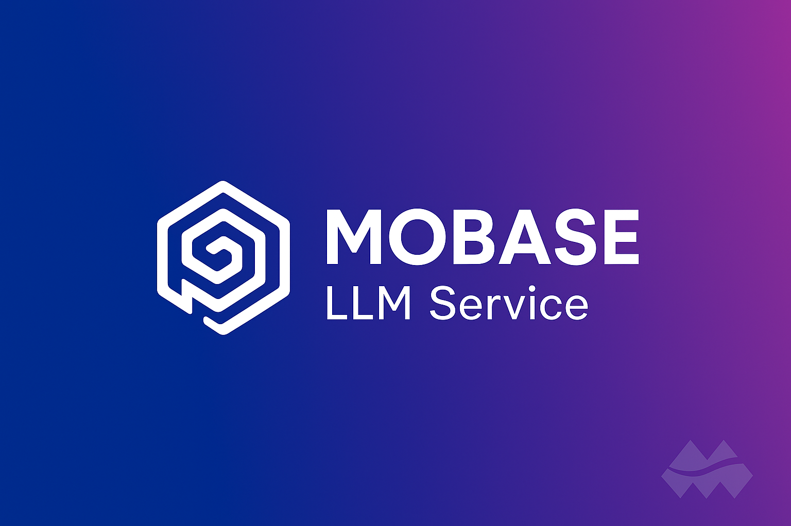
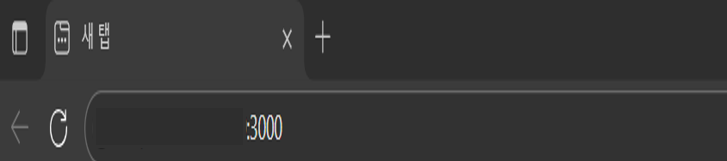
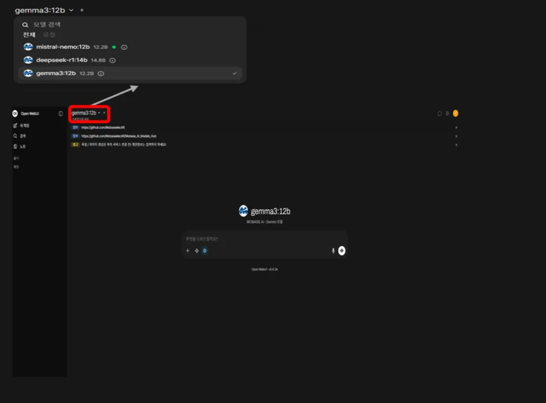

  

---

# 📋 목차

- ### [🚀 1. 계정 생성 및 사용법](#-계정-생성-및-사용법)
- ### [🎯 2. 주요 기능](#-주요-기능)
- ### [⚙️ 3. 구성 모델](#️-구성-모델)

---

 

## 🚀 1. 계정 생성 및 사용법

<b>📝 단계별 가이드 보기</b>

 

### 1단계: 지정된 IP로 접속

 

### 2단계: 계정이 없을 경우 가입 클릭

 

### 3단계: 계정 생성

 

### 4단계: 로그인

<b>⚙️ 설정 및 파일 업로드 가이드 보기</b>

 

### 1. 사용할 LLM 모델 설정

서비스에서 제공하는 다양한 LLM 모델 중 원하는 모델을 선택하세요.

 

### 2. 파일 업로드 지원

> 💡 **추후 추가 예정 기능**
> - 📸 캡처 첨부
> - 🌐 웹페이지 첨부
> - 📄 노트 첨부

 

## 🎯 2. 주요 기능

### 1. 일반 질의응답

<b>자세히 보기</b>

 

다양한 주제에 대해 자연스러운 대화를 통해 정보를 얻을 수 있습니다.

### 2. 코드 생성

<b>자세히 보기</b>

 

요구사항을 입력하면 자동으로 코드를 생성해줍니다.

### 3. 코드 검증

<b>자세히 보기</b>

 

작성한 코드를 분석하고 개선 방안을 제시합니다.

 

## 📊 3. 구성 모델

| Model | 질의응답 (Kor) | 질의응답 (Eng) | 코드 생성 | 코드 리뷰 | 이미지 생성 | 이미지 리뷰 |
|:---|:---:|:---:|:---:|:---:|:---:|:---:|
| **MS 모델** | ✅ | ✅ | ✅ | ✅ | ➖ | ➖ |
| **IBM 모델** | ⚠️ | ✅ | ✅ | ✅ | ➖ | ➖ |
| **GPT 모델** | ✅ | ✅ | ✅ | ✅ | ➖ | ➖ |
| **Alibaba 모델** | ✅ | ✅ | ✅ | ✅ | ➖ | ➖ |
| **Le Chat 모델** | ❌ | ✅ | ✅ | ✅ | ➖ | ➖ |
| **Deepseek 모델** | ⚠️ | ✅ | ✅ | ✅ | ➖ | ➖ |
| **Gemini 모델** | ✅ | ✅ | ✅ | ✅ | ➖ | ➖ |

### 범례
- ✅ 완전 지원
- ⚠️ 부분 지원 (제한적)
- ❌ 미지원
- ➖ 해당 없음

### 주의사항
- **IBM 모델**: 간혹 영어로 생성되는 경우 있음
- **Le Chat 모델**: 한국어가 제대로 생성되지 않는 경우가 많음
- **Deepseek 모델**: 간혹 한문, 영어로 생성됨