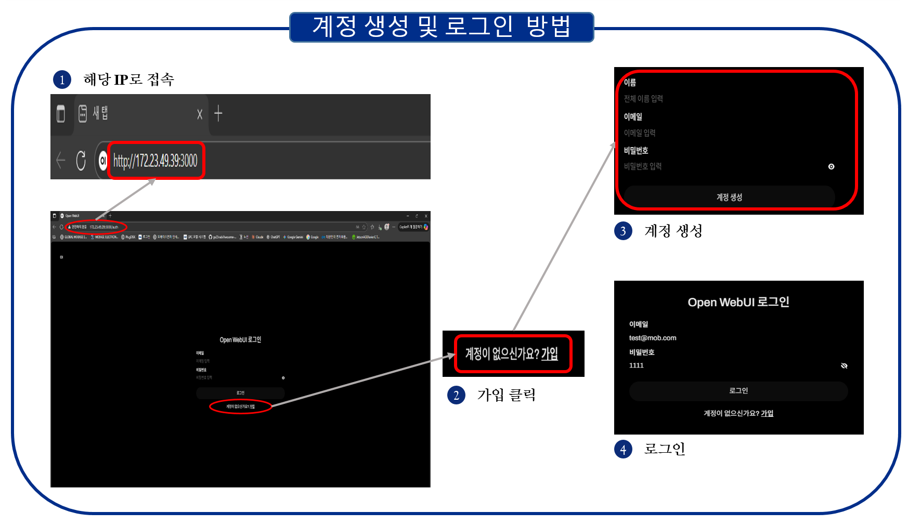
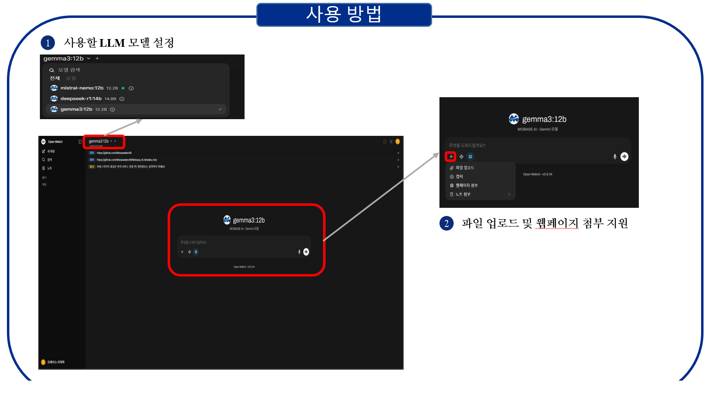

# Mobase_LLM_Service

# 1.  사용방법

# 2.  구성모델

| Model | Support |  |  |  |  |  |
| --- | --- | --- | --- | --- | --- | --- |
|  | 질의응답 |  | 코드 |  | 이미지 |  |
|  | Kor | Eng | 생성 | 리뷰 | 생성 | 리뷰 |
| MS 모델 |  O|  O|  O|  O|  -|  -|
| IBM 모델 |  O|  O|  O|  O|  -|  -|
| GPT 모델 | O |  O|  O|  O|  -|  -|
| Alibaba 모델 |  O|  O|  O|  O|  -|  -|
| Le Chat 모델 |  O|  O|  O|  O|  -|  -|
| Deepseek 모델 | O |  O|  O|  O|  -|  -|
| Gemini 모델 |  O|  O|  O|  O|  -|  -|